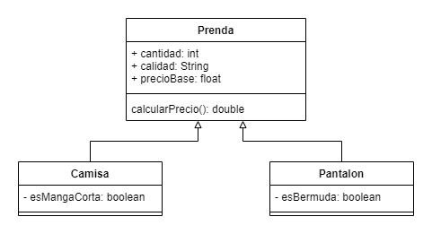

# Grupo nº1

### Integrantes:
 - GianFranco Curci
 - Matías Gonzalo Luna
 
 ## Diagrama de clases conceptual
 
 
 ## Preguntas
 
1. **¿Qué es un clase "sealed"?**
> Una sealed class o clase sellada es aquella de la cual no podemos heredar. Lo que quiere decir que no podemos implementara en otras clases para tener acceso a sus miembros. 

2. **¿Cuáles son los operadores de una expresión relacional?**
> Los operadores relacionales son:

  operador | significa | ejemplo en lenguaje natural
------------- | ------------- | -------------
< | menor que | x es mayor que y
\> | mayor que | x es menor que y
== | mayor que | x es igual a y
!= | No igual a | x no igual a y
<= | menor que o igual a | x es menor que o igual a y
\>= | mayor que o igual a | x es menor que o igual a y

3. **En C# , ¿existe la herencia mútliple?** 

> NO, en C# no existe la herencia múltiple.

4. **¿Cómo invoco el método estático "ValidarDatos()" de la clase "Utiles"?**

> Utiles.ValidarDatos();


5. **Complete el modificador de acceso faltante para declarar el atributo en una clase base y que dicho atributo sea accesibles desde la propia clase y también desde las clases derivadas:**
``` c#
Public class Monedero
{
  _________ int moneda;

  Public Monedero(){}
}
```

> Resolución:

``` java
Public class Monedero
{
  protected int moneda;

  Public Monedero(){}
}
```
 
